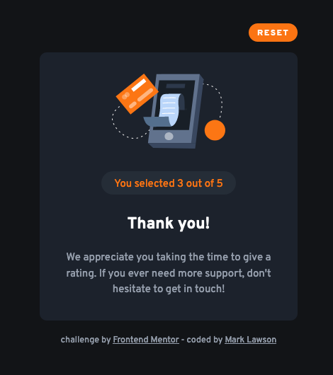

# Frontend Mentor - Interactive rating component solution

This is a solution to the [Interactive rating component challenge on Frontend Mentor](https://www.frontendmentor.io/challenges/interactive-rating-component-koxpeBUmI). Frontend Mentor challenges help you improve your coding skills by building realistic projects.

## Table of contents

- [Overview](#overview)
  - [The challenge](#the-challenge)
  - [Screenshot](#screenshot)
  - [Links](#links)
- [My process](#my-process)
  - [Built with](#built-with)
  - [What I learned](#what-i-learned)
  - [Continued development](#continued-development)
  - [Useful resources](#useful-resources)
- [Author](#author)
- [Acknowledgments](#acknowledgments)

## Overview

### The challenge

Users should be able to:

- View the optimal layout for the app depending on their device's screen size
- See hover states for all interactive elements on the page
- Select and submit a number rating
- See the "Thank you" card state after submitting a rating

### Screenshot

|             Initial State              |             Showing Error              |             Finish State              |
| :------------------------------------: | :------------------------------------: | :-----------------------------------: |
|  |  |  |

### Links

- Solution URL: [Add solution URL here](https://your-solution-url.com)
- Live Site URL: [Here](https://interactive-rating-component-wom.netlify.app/)

## My process

### Built with

- Semantic HTML5 markup
- CSS custom properties
- Flexbox
- Mobile-first workflow

### What I learned

```html
<h1>Some HTML code I'm proud of</h1>
```

```css
.proud-of-this-css {
  color: papayawhip;
}
```

```js
const proudOfThisFunc = () => {
  console.log("🎉");
};
```

### Continued development

### Useful resources

- [Example resource 1](https://www.example.com) - This helped me for XYZ reason. I really liked this pattern and will use it going forward.
- [Example resource 2](https://www.example.com) - This is an amazing article which helped me finally understand XYZ. I'd recommend it to anyone still learning this concept.

## Author

- Website - [Mark Lawson](https://walkonmars.dev/)
- Frontend Mentor - [@walkonmars36](https://www.frontendmentor.io/profile/walkonmars36)
- Twitter - [@\_\_walkonmars](https://www.twitter.com/__walkonmars)
