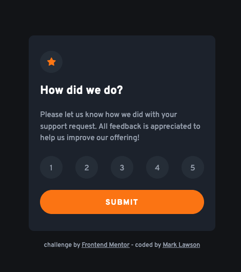
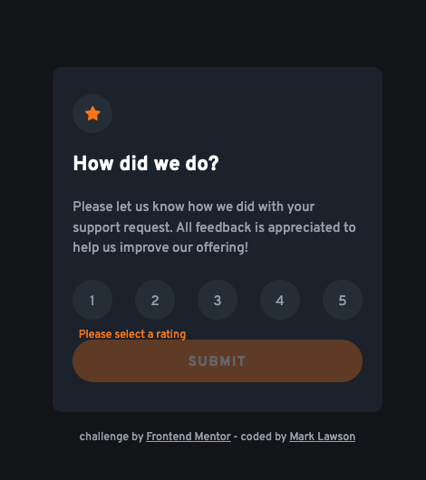
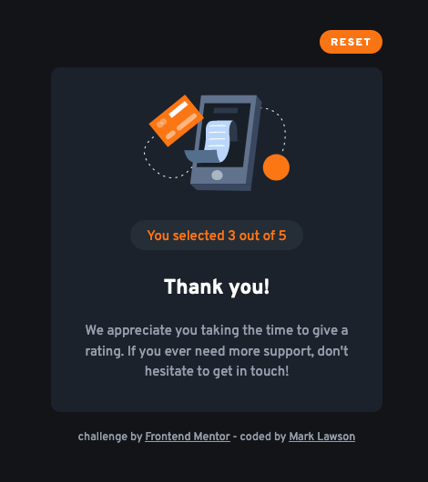

# Frontend Mentor - Interactive rating component solution

This is a solution to the [Interactive rating component challenge on Frontend Mentor](https://www.frontendmentor.io/challenges/interactive-rating-component-koxpeBUmI). Frontend Mentor challenges help you improve your coding skills by building realistic projects.

## Table of contents

- [Overview](#overview)
  - [The challenge](#the-challenge)
  - [Screenshots](#screenshots)
  - [Links](#links)
- [My process](#my-process)
  - [Built with](#built-with)
  - [Continued development](#continued-development)
  - [Useful resources](#useful-resources)
- [Author](#author)

## Overview

### The challenge

Users should be able to:

- View the optimal layout for the app depending on their device's screen size
- See hover states for all interactive elements on the page
- Select and submit a number rating
- See the "Thank you" card state after submitting a rating

### Screenshots

|             Initial State              |             Showing Error              |             Finish State              |
| :------------------------------------: | :------------------------------------: | :-----------------------------------: |
|  |  |  |

### Links

- Solution URL: [Add solution URL here](https://your-solution-url.com)
- Live Site URL: [Here](https://interactive-rating-component-wom.netlify.app/)

## My process

### Built with

- Semantic HTML5 markup
- ARIA roles
- CSS custom properties
- Flexbox
- Mobile-first workflow
- JavaScript

### Continued development

I'm beginning to focus a lot on accessibility and ensuring (as far as I can) to build accessible pages, both with using semantic markup and the appropriate ARIA roles. This is high on my list at the moment.

### Useful resources

- [The A11y Project](https://www.a11yproject.com/) - The home of the a11y (accessibility) project.

- [web.dev intro to ARIA](https://web.dev/semantics-aria/) - Introduction to ARIA from the web.dev Chrome team.

- [a11y coffee project](https://a11y.coffee/) - this is a useful resource too.

## Author

- Website - [Mark Lawson](https://walkonmars.dev/)
- Frontend Mentor - [@walkonmars36](https://www.frontendmentor.io/profile/walkonmars36)
- Twitter - [@\_\_walkonmars](https://www.twitter.com/__walkonmars)
